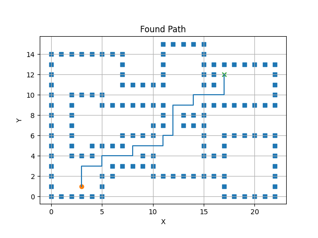
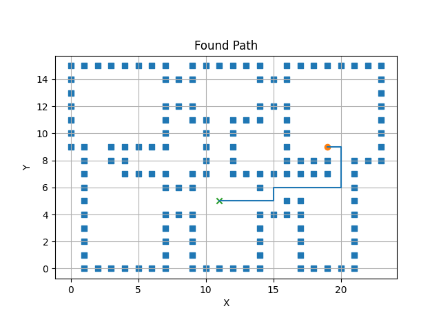
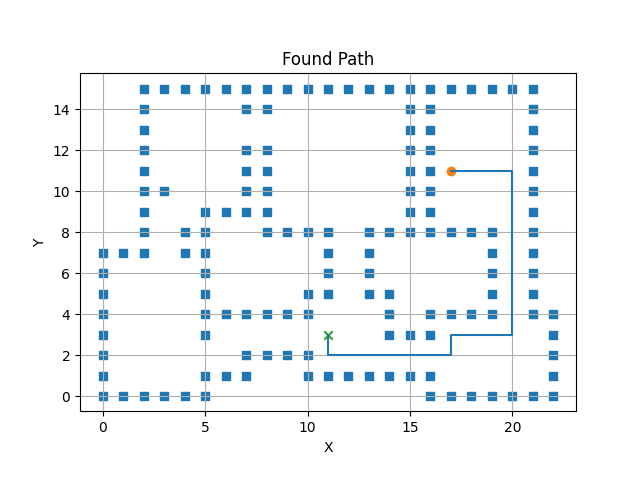

# CMPE434: Introduction to Robotics - Term Project
### Berke Can Göktaş - 2021401042
## Problem Definition
In this project, the autonomous guidance and obstacle avoidance of a robot in a randomly generated maze is the requirement.
The randomly generated maze and moving obstacles were initially provided in the starter code and it was expected to plan the path
from start point towards the finish point with an appropriate planning strategy and then autonomously following the planned path 
without collision with neither the moving obstacles or the walls of the maze. In this project, _A*_ algorithm for path planning, _pure
pursuit_ for path tracking and _force fields_ for collision avoidance are chosen. Each of the chosen strategy is explained next.
## Approaches
### Path Planning
For path planning, A* algorithm is chosen. This algorithm is advantageous for its success to find a suitable path (compared to approaches
such as probabilistic road map) ans efficiency (compared to approaches such as djikstra's algorithm). To use A* in the project, the implementation
from python robotics repository was taken: [A* Python Robotics](https://github.com/AtsushiSakai/PythonRobotics/tree/master/PathPlanning/AStar).
However, as it was seen in the development process, using the planned path of A* directly can be tricky and sometimes inappropriate. This is due to the 
differences in the planned grid and the simulation environment and limitations of the robot used. To solve this issue, the original path found with A* 
is changed to a somewhat better path with safer turns and straighter path. Some example paths can be seen below. 
 

**Figure 1: A* Planned and Adjusted Path Example-1** 

**Figure 2: A* Planned and Adjusted Path Example-2**  

Even though the resulting paths were good to use and the path planning was complete, it could still be developed further for better paths with lesser turns.
As it can be seen below, the generated paths still contain some unnecessary turns such as the one on the bottom right side of the map, however since the resulting path was good enough that adjustment was not made.

**Figure 3: A* Planned and Adjusted Path Example-3**  
### Path Tracking
After a successful path planning, the robot requires to track the found path. For that purpose, pure pursuit algorithm is chosen and implemented. Pure pursuit is a method in which the robot always tries to track a point on the path some distance away from itself. That way it always tries to pursue the path and tracks successfully even when there are turns and such. It is also advantageous since it has only two configurable parameter, namely look ahead distance and gain. For good results both the gain and look ahead distance has to be neither too low or too high and the best way to adjust is to try different parameters (a huge drawback of the algorithm). However, after some trial and error, acceptable parameters were found and then the driving was further improved by adding noise cancelling (with low pass filter and clipping) and steering adjusted speed control.
### Correcting the Initial Heading
Since the initial robot heading is randomized, there is a requirement for adjusting the heading towards the first planned waypoint at the start. For this reason, an algorithm was written. Algorithm first gets the current heading of the robot and produces an error from the difference between desired heading (computed from the first waypoint coordinates) and the actual. Then, starts turning from the shorter side until the error is smaller than a certain threshold. While doing this turn movement, the algorithm also checks for collision with the walls and obstacles and if it detects possible collision, makes the robot go back to a safe distance and starts turning again. This makes the turn slower when there are walls nearby but protects from any collision initially. Since this collision algorithm is explained in the next section, it will not be examined further here. 
### Collision Avoidance
Force field approach is a method for collision avoidance and it is the chosen method for this project. The obstacles in the environment produce a repelling force in this approach and that repulsion makes the robot move away from the obstacles in a natural way. However, since the repulsion is done in a radius, basic application of this method is not the best approach for collision avoidance. To create more natural movements, the repulsion force of the obstacles are adjusted using the heading between the robot and the obstacle, the distance between them and then ignored when the obstacle is passed. Also, another more static repulsion algorithm is used for walls and the two repulsion force is combined. The combined force creates a steering value for the robot and thus makes it possible to avoid collision. If the force is too large, the algorithm assumes collision is inevitible with just steering and makes the robot go back until the force is small enough to safely steer again. This approach is also the one mentioned above for avoiding collision while correcting the initial heading. The repulsion radius, repulsion strength, gain and repulsion threshold are all need to be adjusted making the required parameters and thus trial and errors high. Even though that's the case, it is still an easier and computationally more efficient approach compared to methods such as dynamich window approach. However, due to its simple nature, force field approach is not the best with the edge cases and some drawbacks occur. These can be listed as:
- The repulsion force may be to the same direction of the obstacle movement making collision inevitible.
- The repulsion force from a complex encounter may result in strange behaviour making the robot lost its collision free movement.
- The repulsion may be too strong for far away obstacles making unnecessary steering behaviour or too weak for near obstacles resulting unsatisfactory steering.

Two successful and one failure cases are shown below for both path tracking, heading adjustment and collision avoidance demonstration.

**Video 1: A Successful Demonstration-1**  

**Video 2: A Successful Demonstration-2**  

**Video 3: An Unsuccessful Demonstration**  

## Results
As it can be seen from the demonstration videos, the approach is successful but still imperfect. It lacks the power to handle the edge cases and fails from time to time. So to improve the controller more layers has to be added or the force field approach has to be abandoned. Either way, the robot can be improved but since the main goal of the project was to use these algorithms for real use cases, the development process was stopped here.
